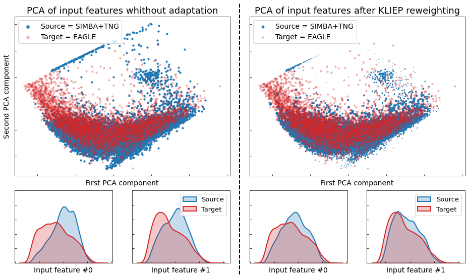

# Unsupervised-Domain-Adaptation-For-Star-Formation-History

This repository provides the experiments of the paper [Unsupervised Domain Adaptation for Constraining Star Formation Histories](https://arxiv.org/pdf/2112.14072.pdf).

This study has been conducted with the help of the [ADAPT](https://github.com/adapt-python/adapt) library.

## Abstract

The prevalent paradigm of machine learning today is to use past observations to predict future ones. What if, however, we are interested in knowing the past given the present? This situation is indeed one that astronomers must contend with often. To understand the formation of our universe, we must derive the time evolution of the visible mass content of galaxies based on the Spectral Energy Distribution (SED) observed on earth.

## What’s the problem?

As galaxies evolve over billions of years, it is impossible to completely capture any single galaxy’s mass evolution as a function of time. Astrophysicists then generate cosmological simulations, which allow building artificial star formation histories with the corresponding radiation. However, a significant challenge arises due to the domain shift between simulated and real galaxies (see Figure 1).

  <figure>
    
    <figcaption> <b>Figure 1</b>: <i>Radiation spectrums with corresponding star formation histories can be recorded from cosmological simulation to form a dataset (X, y). This dataset is used to learn a machine learning model. Because of the domain shift between real radiation spectrums and simulated ones, domain adaptation is used to adapt the learned machine learning model to the real observations.</i></figcaption>
  </figure>

## Methodology

The experiments can be run with the ``run_experiments.ipynb`` notebook. Figure 2 can be reproduced with the ``kliep_weights_visualization.ipynb`` notebook.

Our training and test data sets consist of SEDs from three state of the art cosmological galaxy formation simulations **SIMBA** [[1]](#references), **EAGLE** [[2]](#references) and **IllustrisTNG** [[3]](#references) (The three datasets can be found in the ``datasets`` folder). Input consists of flux densities in 20 filters, and output consists of SFH (time series) in 29 bins from t=0 to t=13.8 billion years ago. We train on any two simulations and test on the third one. This is a necessary first step in developing a technique that can ultimately be applied to observational data.
1. We apply **KLIEP** [[4]](#references), an instance based method that reweights the sources in order to minimize the KL divergence between any two domains.
2. We normalize each SFH time series vector by its sum, and apply kernelPCA to reduce the dimensionality of the normalized SFH time series vectors from 29 to 3.
3. We fit two NNs on the source data using the KLIEP derived importance weights: ne network to predict the 3 kPCA components, the other to predict SFH_sum.

  <figure>
    
    <figcaption> <b>Figure 2</b>: <i>KLIEP brings different domains closer by reweighing source samples. <b>Top</b>: Scatter plot of the first two kPCA components. <b>Bottom</b>: KDE plots of log of the first two features.</i></figcaption>
  </figure>

## Results

The results can be computed with the ``results.ipynb`` notebook.

  <figure>
    
    <figcaption> <b>Figure 3</b>: <i>Global SFH predictions for the <b>IllustrisTNG</b> experiments. The curves correspond to the sums over all predicted SFH for different domain adaptation methods</i></figcaption>
  </figure>

  <figure>
    
    <figcaption> <b>Figure 3</b>: <i>Global SFH predictions for the <b>EAGLE</b> experiments. The curves correspond to the sums over all predicted SFH for different domain adaptation methods</i></figcaption>
  </figure>

  <figure>
    
    <figcaption> <b>Figure 3</b>: <i>Global SFH predictions for the <b>SIMBA</b> experiments. The curves correspond to the sums over all predicted SFH for different domain adaptation methods</i></figcaption>
  </figure>

## References
- [1] Davé R. et al. 2019. SIMBA: Cosmological simulations with black hole growth and feedback.
*Monthly Notices of the Royal Astronomical Society*. 486 2 2827 2849. [[paper]](https://arxiv.org/abs/1901.10203)
- [2] Schaye J. et al. 2015. The EAGLE project simulating the evolution and assembly of galaxies and
their environments. *Monthly Notices of the Royal Astronomical Society*. 446 1 521 554. [[paper]](https://arxiv.org/abs/1407.7040)
- [3] Vogelsberger M. et al. 2014. Introducing the Illustris Project simulating the coevolution of dark
and visible matter in the Universe. *Monthly Notices of the Royal Astronomical Society*. 444 2 1518 1547 [[paper]](https://arxiv.org/abs/1405.2921)
- [4] Sugiyama, M. et al. 2007. Direct Importance Estimation with Model Selection and Its Application to
Covariate Shift Adaptation. *In Proceedings of the 20 th International Conference on Neural Information
Processing Systems, NIPS’ 07*. 1433 1440 Red Hook, NY, USA Curran Associates Inc. [[paper]](https://papers.nips.cc/paper/2007/hash/be83ab3ecd0db773eb2dc1b0a17836a1-Abstract.html)

